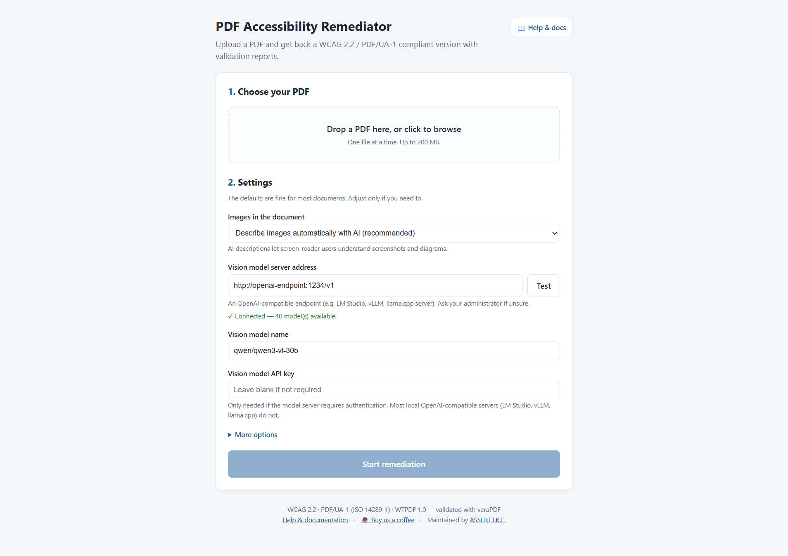
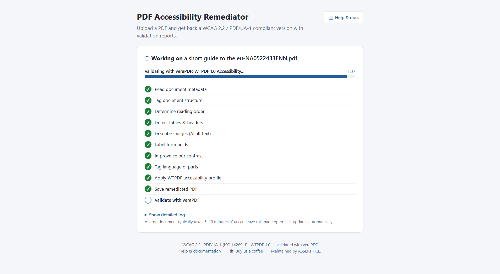
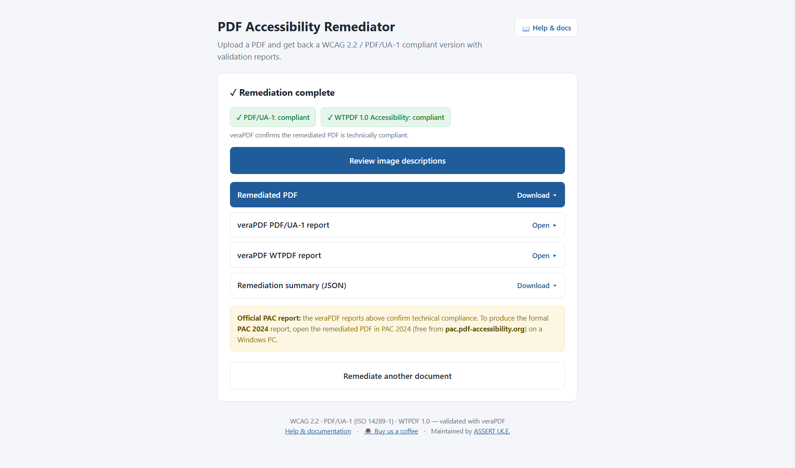
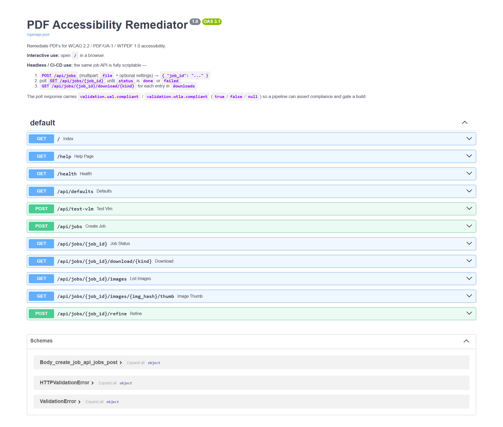

# pdf_a11y — Programmatic PDF Accessibility Remediation

[](https://verapdf.org/)
[](https://www.python.org/)
[](https://github.com/adamopoulosa1980/pdf_accessibility/pkgs/container/pdf-accessibility)
[](https://hub.docker.com/r/adamopoa/pdf-accessibility)
[](https://buymeacoffee.com/alexadamopoulos)

> **Programmatic PDF accessibility remediation for organisations facing
> the EU Accessibility Act, US Section 508, ADA, and WCAG 2.2 audits —
> without sending sensitive documents to anyone's cloud. WCAG 2.2 /
> PDF/UA-1 / WTPDF 1.0 compliant in ~5 minutes per document.
> Validator-verified by veraPDF. Open source.**

## Who this is for

- **Engineering & DevOps teams** wiring PDF accessibility into existing
  CI/CD pipelines or document-processing back-ends. Headless HTTP API,
  CLI, and Python library on the same engine.
- **Compliance, legal & accessibility officers** preparing a document
  portfolio for an **EU EAA**, **US Section 508**, **ADA**, or
  **WCAG 2.2** audit — without €50–150-per-page manual remediation costs
  or sending originals to a third-party cloud service.
- **Document management & EDM vendors** (DMS, intranet platforms,
  publishing tools) embedding accessibility remediation as a feature
  inside their own product — on-premises, no per-document SaaS fee.

## Why now

The **EU Accessibility Act (Directive 2019/882)** has been enforceable
since **28 June 2025**, requiring accessible digital content from any
private-sector body trading in the EU. The **US Section 508 Refresh**
and incoming **EN 301 549 v3.2.1** procurement standard tighten the
same requirements for public-sector and supplier ecosystems. A document
portfolio that fails a screen-reader audit is now a **compliance
liability** for any organisation that publishes PDFs at scale —
universities, banks, insurers, public-sector bodies, regulated
enterprises.

## Commercial services

The open-source pipeline is the whole engine — fully usable, fully
self-hostable, no feature paywall. **[ASSERT I.K.E.](mailto:info@assert.gr)**
sells time and judgment around it, not gated features. Reach out when
you need:

- an **air-gapped or on-premises deployment** with a documented runbook;
- a **local vision model provisioned and tuned** for your document
  volume and GPU budget (vLLM, LM Studio, llama.cpp);
- a **bulk remediation of an existing PDF portfolio**, with the
  human-in-the-loop alt-text review process operated as a service;
- **prioritised feature work** on a specific milestone (MathML, OCR for
  scanned PDFs, EN 301 549 profile, PDF/UA-2 support).

Casual open-source support via
[☕ Buy Me a Coffee](https://buymeacoffee.com/alexadamopoulos). Full
service breakdown: [Funding & paid services](#funding--paid-services).

## How we keep it honest

Design choices that matter to your security, compliance, and engineering
review — written for the technical reader your business stakeholder will
forward this page to:

- **Validator-gated output.** Every remediated PDF passes through
  **veraPDF** (PDF/UA-1 and WTPDF 1.0 profiles) inside the pipeline. A
  document that does not pass is returned with its veraPDF rule failures
  attached; AI output is never marketed as "compliant" without machine-
  checkable proof.
- **Deterministic core, AI only at the edges.** Tagging, struct-tree
  fixes, contrast remediation, language detection, the WTPDF profile
  fixer, and the validator pass are all deterministic code paths. A
  vision-language model is invoked **only** for image alt text — and
  every generated description is reviewable + overridable through the
  [human-in-the-loop screen](#human-in-the-loop-workflow) before the
  PDF ships.
- **Audit-ready artefacts.** Each run emits a JSON report (every
  remediation decision with its WCAG / PDF/UA / WTPDF citation) plus
  both veraPDF HTML reports — these are the artefacts an accessibility
  auditor or procurement reviewer actually wants to see.
- **No mandatory cloud round-trip.** The default VLM is any
  OpenAI-compatible local server (LM Studio, vLLM, llama.cpp, Ollama).
  Documents do not leave your network unless you deliberately point at
  a cloud provider.
- **Open source, end to end.** Every fixer, every API endpoint, the
  full Docker recipe, and the security posture are in this repo. Your
  security team can read it before deployment instead of trusting a
  vendor's word.
- **Honest about scope.** [§ What it does NOT do](#what-it-does-not-do)
  lists what is best-effort or out of scope today (complex multi-column
  layouts, scanned PDFs without OCR, MathML, …). Read it before
  budgeting — we would rather lose a deal than ship a surprise.



---

A modular pipeline that takes an existing (often untagged) PDF and produces
a **WCAG 2.2 / PDF/UA-1 (ISO 14289-1) / WTPDF 1.0 Accessibility** compliant
document — **without any paid service**.

It is a practical, free, fully local alternative to Adobe Acrobat's
*Autotag* / paid remediation services. It combines:

- the Apache-2.0 **`opendataloader-pdf`** structure tagger (local, JVM-based),
- a **Vision Language Model** for image alt text — any **OpenAI-compatible
  inference engine** (LM Studio, vLLM, llama.cpp server, Ollama, …) running
  a VL model like Qwen3-VL, or cloud Claude / GPT-4o,
- five content-stream **post-processing passes** that fix the things a raw
  tagger gets wrong, and
- a **`WTPDFFixer`** for the strict PDF 2.0 / WTPDF rules,

then validates the result with **veraPDF**.

It runs three ways: a **point-and-click web app** (Docker), a **headless
HTTP API** for CI/CD, and a **command-line tool** / Python library.

> **Reference result, reproducible in 10 minutes.** The repo bundles an
> actual European Commission publication — *A short guide to the EU*
> ([examples/](examples/), 36 pages, ~10 MB, public domain) — as a demo
> input. With default settings the pipeline takes it to **0 of 106
> failures on veraPDF PDF/UA-1** and **0 of 1723 failures on veraPDF
> WTPDF 1.0 Accessibility**. PAC 2024 reports 0 failures plus a few
> hundred soft *warnings* — soft, human-review tagging-style flags that
> are not ISO violations; see
> [Validators](#validators--what-compliant-means). Run it yourself
> via the steps under
> [Try it on the bundled example](#try-it-on-the-bundled-example).

---

## Contents

- [Who this is for](#who-this-is-for)
- [Why now](#why-now)
- [Commercial services](#commercial-services)
- [How we keep it honest](#how-we-keep-it-honest)
- [Why this is an Adobe Autotag alternative](#why-this-is-an-adobe-autotag-alternative)
- [What it actually fixes](#what-it-actually-fixes)
- [Run it 1 — Web app (Docker)](#run-it-1--web-app-docker)
- [Run it 2 — Headless API (CI/CD)](#run-it-2--headless-api-cicd)
- [Run it 3 — Command line](#run-it-3--command-line)
- [Architecture](#architecture)
- [Tagging engines](#tagging-engines)
- [Image alt-text providers](#image-alt-text-providers)
- [Validators — what "compliant" means](#validators--what-compliant-means)
- [Human-in-the-loop workflow](#human-in-the-loop-workflow)
- [Configuration](#configuration)
- [Performance](#performance)
- [What it does NOT do](#what-it-does-not-do)
- [Troubleshooting](#troubleshooting)
- [Funding & paid services](#funding--paid-services)
- [Liability & disclaimer](#liability--disclaimer)

---

## Why this is an Adobe Autotag alternative

Adobe Acrobat *Autotag* (and the Adobe PDF Services Autotag API) is a
high-quality **structure tagger**. But tagging is only **one step** of
remediation. Autotag output, on its own, is **not** a PDF/UA-1 document:

> In our reverse-engineering tests, a file processed by Adobe Autotag alone
> still failed **veraPDF PDF/UA-1 with over 1,300 rule violations** — missing
> the XMP `pdfuaid` marker, role-mapped but unverified structure, link
> destinations, PUA `/ActualText`, WTPDF declarations, and more.

`pdf_a11y` does the **whole job**: metadata, tagging, the post-tagging
content-stream fixes, image alt text, contrast, language, the WTPDF 2.0
rules, then validation. The structure tagger is pluggable — you *can* set
`tagging.engine: adobe` — but the **default `opendataloader` engine reaches
veraPDF compliance with no paid API and no data leaving your network**.

| | Adobe Acrobat / Autotag API | `pdf_a11y` (default config) |
| --- | --- | --- |
| Cost | Per-seat licence / per-call API | Free, open-source |
| Data residency | Uploaded to Adobe cloud (Autotag API) | 100% local — no document leaves your network |
| Scope | Tagging (+ manual fixes in Acrobat) | Full pipeline: tag → fix → alt text → validate |
| veraPDF PDF/UA-1 out of the box | ❌ tagging only | ✅ |
| veraPDF WTPDF 1.0 out of the box | ❌ | ✅ |
| Batch / CI-CD | Limited | ✅ CLI + HTTP API |
| Automation of alt text | Manual | ✅ VLM-generated |
| Reproducible (config-as-code) | ❌ | ✅ single YAML file |

---

## What it actually fixes

| WCAG / PDF/UA / WTPDF | Description | Coverage |
| --- | --- | --- |
| 1.1.1 | Alt text on images | ✅ VLM-generated, written to `/Figure` StructElem + image XObject |
| 1.3.1 | Tagging / table headers | ✅ via `opendataloader` (Apache 2.0), or `adobe` / `pdfix` |
| 1.3.2 | Meaningful sequence | ✅ `/Tabs=/S`; reading-order analysis |
| 1.4.3 | Contrast minimum | ⚠ report + configured palette remap (hex → hex) |
| 2.4.2 | Page titled | ✅ full |
| 2.4.3 | Focus order | ✅ `/Tabs = /S` |
| 3.1.1 | Document language | ✅ full |
| 3.1.2 | Language of parts | ✅ detection + reporting |
| 4.1.2 | Name, role, value (forms) | ✅ tooltips from nearby text / field name / config |
| PDF/UA-1 5-1 | XMP `pdfuaid:part` marker | ✅ re-applied after taggers that rewrite XMP |
| PDF/UA-1 7.3-1 | Figure must have `/Alt` or `/ActualText` | ✅ VLM alt; placeholder retained for decoratives |
| WTPDF 6.1.3-1 | `pdfd:Declarations` accessibility URI | ✅ injected by `WTPDFFixer` |
| WTPDF 8.2.5.2-2 | `/Document` in PDF 2.0 namespace | ✅ injected by `WTPDFFixer` |
| WTPDF 8.4.3-1 | PUA glyphs need `/ActualText` | ✅ added to struct elems containing icon-font glyphs |
| WTPDF 8.8-1 | Internal links resolve to a structure element | ✅ `/A /GoTo` with **dual** `/D` (page) + `/SD` (struct) destinations |
| WTPDF 8.9.4.2-1 | Annot `/Contents` must byte-equal enclosing `/Alt` | ✅ synced via `WTPDFFixer` |
| PDF 2.0 §8.5 | No `BMC`/`BDC` inside path-construction state | ✅ post-tagging fixup of `opendataloader` output |
| Matterhorn 01-001 | Every BT/ET text object inside a marked-content sequence | ✅ BT/ET wrap fixup |
| Matterhorn 01-001 | TOC dot-leaders marked `/Artifact`, not tagged content | ✅ decorative-block demotion |
| ISO 14289-1 §7.1 | Artifacts classified (`/Pagination` header/footer, `/Layout`) | ✅ typed-artifact classification |
| PDF/UA-1 7.1-3 / WTPDF 8.2.2-1 | Stray painting ops left untagged by the tagger | ✅ post-tagging sweep wraps them as `/Artifact BMC..EMC` (`ArtifactWrapFixer`) |
| PDF/UA-1 7.20-2 | Form XObject with MCIDs referenced from >1 page (repeating headers/footers) | ✅ MCIDs stripped, struct-tree refs pruned, XObject demoted to `/Artifact` (`SharedXObjectFixer`) |
| ISO 32000-1 §7.9.7 | **ParentTree `/Nums` keys in ascending order** | ✅ **`_sort_parent_tree_nums`** — see note below |

✅ = fully automated · ⚠ = report-first, controlled by config

> **The ParentTree sort.** `opendataloader` writes the `StructTreeRoot`
> `/ParentTree` number tree with its `/Nums` keys **out of order**. ISO
> 32000-1 §7.9.7 requires number-tree keys ascending. An unsorted tree
> makes a validator unable to resolve marked content back to its structure
> element — in our testing on a large document this single defect produced
> **~16,800 "content not tagged" failures in PAC**. Sorting the `/Nums`
> array in place drove those to **zero**. It is the highest-impact fix in
> the pipeline and the reason raw tagger output (from *any* engine) needs
> post-processing.

---

## Run it 1 — Web app (Docker)

A self-contained, self-explanatory web app for non-technical users. Upload a
PDF, optionally adjust a few settings, watch live progress, download the
remediated PDF plus veraPDF reports. The container bundles **everything** —
Python, a Java runtime (for `opendataloader`), and veraPDF. The only external
dependency is a vision-model endpoint, and its URL is configurable per upload.

### Quick start — pull the published image (no build)

```bash
docker run -d --name pdf-a11y -p 8000:8000 \
  -e VLM_BASE_URL="http://your-vlm-host:1234/v1" \
  -e VLM_MODEL="qwen/qwen3-vl-30b" \
  -v pdf-a11y-jobs:/data/jobs \
  ghcr.io/adamopoulosa1980/pdf-accessibility:latest
```

The same image is mirrored to Docker Hub as
`adamopoa/pdf-accessibility:latest` if you prefer.
Pinned versions (`:v2.2`, `:v2.3`, …) are published on every release tag.

### Quick start — build locally (active development)

From the **`webapp/`** directory:

```bash
docker compose up -d --build
```

Open **`http://<server-host>:8000`**. Edit the `environment:` block in
[webapp/docker-compose.yml](webapp/docker-compose.yml) first so `VLM_BASE_URL`
points at a vision-model server the host can reach.

### Plain Docker (build from the **project root**)

```bash
docker build -f webapp/Dockerfile -t pdf-a11y-remediator:1.0 .

docker run -d --name pdf-a11y -p 8000:8000 \
  -e VLM_BASE_URL="http://your-vlm-host:1234/v1" \
  -e VLM_MODEL="qwen/qwen3-vl-30b" \
  -v pdf-a11y-jobs:/data/jobs \
  pdf-a11y-remediator:1.0
```

### Using the web UI

1. **Choose your PDF** — drag-and-drop or browse.
2. **Settings** — defaults are fine; the vision-model address is pre-filled.
   A **Test** button confirms it is reachable. Optional **API key** field for
   servers that require authentication (most local OpenAI-compatible servers
   do not).
3. **Start remediation** — a live checklist shows each pipeline step; a large
   document takes 5–10 minutes.

   

4. **Download** — the remediated PDF plus the veraPDF PDF/UA-1 and WTPDF
   reports, each with a pass/fail badge.

   
5. **Review image descriptions** *(optional)* — a button on the results card
   opens a thumbnail grid of every image the AI processed. Edit the
   description, mark it decorative, or accept it as-is; clicking **Apply
   changes & re-run** re-runs the pipeline on the same original PDF with
   your edits merged in. No more CSV-by-SHA-256 round-trips.

A **Help & docs** link in the UI opens this README at `/help`.

> The official **PAC 2024** report is produced by the user afterward, by
> opening the remediated PDF in PAC 2024 on Windows. veraPDF (bundled) gives
> the same technical verdict and is enough to gate a build.

### Configuration (environment variables)

| Variable | Default | Purpose |
| --- | --- | --- |
| `VLM_BASE_URL` | *(from config file)* | Vision-model server URL pre-filled in the UI |
| `VLM_MODEL` | *(from config file)* | Vision-model name pre-filled in the UI |
| `VLM_API_KEY` | *(unset)* | Deployment-wide VLM API key (used when a user leaves the key field blank) |
| `MAX_CONCURRENT_JOBS` | `1` | Documents processed at once |
| `JOB_RETENTION_HOURS` | `24` | Finished jobs + files are purged after this |
| `MAX_UPLOAD_MB` | `200` | Upload size limit |
| `JOBS_DIR` | `/data/jobs` | Where uploads/results live (mount a volume) |
| `VERAPDF_PATH` | `/opt/verapdf/verapdf` | veraPDF launcher |
| `VERAPDF_TIMEOUT` | `1200` | Per-profile veraPDF timeout (seconds) |
| `BASE_CONFIG` | `/app/config/remediation_config.yaml` | Pipeline config baked into the image |

Per-upload settings always override the defaults. The tagging engine is fixed
to `opendataloader` in the web app (free, local, no keys).

> **Trusted network.** The web app has no authentication — deploy it behind
> your network boundary, or in front of a reverse proxy that adds auth, as
> intended for an internal tool.

---

## Run it 2 — Headless API (CI/CD)

The job API needs no browser. Interactive OpenAPI docs are at **`/docs`**:



| Method & path | Purpose |
| --- | --- |
| `POST /api/jobs` | Submit a PDF (multipart `file` + settings) → `{ "job_id": ... }` |
| `GET  /api/jobs/{id}` | Poll status, progress, `validation`, `downloads` |
| `GET  /api/jobs/{id}/download/{kind}` | Fetch an artefact (`kind` from the `downloads` map) |
| `GET  /api/jobs/{id}/images` | List every image with current alt text + thumbnail URL (powers human-in-the-loop review) |
| `GET  /api/jobs/{id}/images/{hash}/thumb` | PNG thumbnail for one image |
| `POST /api/jobs/{id}/refine` | Submit alt-text overrides; spawns a new job re-running on the same original PDF |
| `POST /api/test-vlm` | Check a VLM URL is reachable |
| `GET  /health` | Liveness + veraPDF availability |

A poll response carries `validation.ua1.compliant` and
`validation.wt1a.compliant` (`true` / `false` / `null`) so a pipeline can
assert compliance and gate a build.

### Human-in-the-loop alt text (UI + API)

The single hardest part of accessibility automation is the cases where the
vision model gets an image description wrong (or marks the cover-page logo
as `"image 2"`). The web app exposes a thumbnail-grid review screen for
those, and the **same backend endpoints are public API** so a CI/CD
pipeline can plug a human into the loop too.

Typical CI/CD pattern:

1. `POST /api/jobs` → wait for `done`.
2. `GET /api/jobs/{id}/images` → JSON with one entry per unique image
   (`hash`, `alt`, `source`, `width`, `height`, `thumb_url`, `occurrences`).
   `source` is one of `vlm` / `override` / `decorative_auto` /
   `decorative_vlm` / `manual_required` / `pending_vlm`.
3. Filter where `source == "manual_required"` (the VLM gave up). Post each
   one — with the thumbnail — to your review queue: Linear / Jira /
   ServiceNow / Slack / SharePoint list / whatever.
4. When a reviewer fills in a description, your webhook calls
   `POST /api/jobs/{id}/refine` with `{ "overrides": { "<hash>": "alt text" } }`.
5. The response gives a fresh `job_id`; poll it like any other job. The
   resulting PDF carries every previous override **plus** the new one
   (refinements chain — each child remembers its parent's overrides).

Minimal `curl`:

```bash
# After a job finishes, list its images
curl -sf http://host:8000/api/jobs/$JOB/images | jq '.images[] |
  select(.source=="manual_required") | {hash, occurrences}'

# Submit reviewer-supplied alt text — gets back a new job_id
NEW=$(curl -sf -X POST http://host:8000/api/jobs/$JOB/refine \
  -H 'Content-Type: application/json' \
  -d '{"overrides":{"a3f5b8c1":"Diagram of the NCTS Phase 6 message flow",
                    "9e2d1a4f":"DECORATIVE"}}' | jq -r .job_id)

# Same poll loop as a normal job
curl -sf http://host:8000/api/jobs/$NEW
```

The value sentinel `"DECORATIVE"` (uppercase) marks the image as an
artifact instead of supplying alt text — same schema as the
`images.alt_overrides` config field, so a CI script that already produces
that file can post it straight to `/refine` unchanged.

### Bundled client

[webapp/client.py](webapp/client.py) uploads, waits, downloads, and sets an
exit code:

```bash
python webapp/client.py doc.pdf \
  --server http://host:8000 \
  --out ./results \
  --require-compliant       # exit 2 unless every veraPDF profile passes
```

Exit codes: `0` ok · `1` job failed · `2` not compliant · `3` usage/connection error.

### Raw `curl`

```bash
JOB=$(curl -sf -F file=@doc.pdf -F image_strategy=vlm \
        http://host:8000/api/jobs | jq -r .job_id)

while :; do
  S=$(curl -sf http://host:8000/api/jobs/$JOB)
  echo "$S" | jq -r '.status + " — " + .phase'
  ST=$(echo "$S" | jq -r .status)
  [ "$ST" = done ] || [ "$ST" = failed ] && break
  sleep 5
done

curl -sf -o doc_a11y.pdf http://host:8000/api/jobs/$JOB/download/remediated_pdf
```

### CLI inside the image (no server)

```bash
docker run --rm -v "$PWD:/work" -w /work pdf-a11y-remediator:1.0 \
  python -m pdf_a11y /work/doc.pdf --config /app/config/remediation_config.yaml
```

---

## Run it 3 — Command line

```bash
pip install -r requirements.txt
# Install Java 11+ (for tagging.engine = opendataloader / adobe) — https://adoptium.net
# Install veraPDF once (see below)

# Everything tunable is in one file:
python -m pdf_a11y path/to/document.pdf
```

### CLI flags

| Flag | Effect |
| --- | --- |
| `--config <path>` | Use a non-default config file (default: `config/remediation_config.yaml`). |
| `--recursive`, `-r` | When the input is a directory, process every `*.pdf` under it. |
| `--quiet`, `-q` | Suppress per-finding output. JSON reports are still written. |

Output goes to `./output/` by default:

- `<name>_a11y.pdf` — remediated PDF
- `<name>_report.json` — full audit trail of every change, incl. veraPDF rule pass/fail and per-image VLM alt text
- `<name>_original.pdf` — backup of the source
- `<name>_images_review.csv` — images needing manual alt text (only if any)

### As a library

```python
from pdf_a11y import Config, RemediationPipeline

cfg = Config.load("config/remediation_config.yaml")
report = RemediationPipeline(cfg).run("input.pdf")

print(f"Output: {report.output_pdf}")
for finding in report.findings:
    if finding.severity == "manual_required":
        print(f"NEEDS REVIEW: [{finding.wcag}] {finding.message}")
```

### Try it on the bundled example

The repository ships a real-world test document at
[examples/a short guide to the eu-NA0522433ENN.pdf](examples/) — the
European Commission's *A short guide to the EU* (36 pages, ~10 MB,
public-domain). It has the failure modes that trip naive pipelines:
untagged decorative graphics, repeating header/footer Form XObjects with
MCIDs, complex multi-column layouts.

```powershell
# Install veraPDF first (see "Installing veraPDF" below)
.\scripts\install-verapdf.ps1

# Run the pipeline. To skip the VLM step (no model server needed), set
# `images.strategy: "decorative"` in the config; otherwise point
# `images.vlm.base_url` at an OpenAI-compatible server.
python -m pdf_a11y "examples/a short guide to the eu-NA0522433ENN.pdf"
```

You should see:

```text
[1/9] Document metadata ...
[2/9] Tagging document structure ...
[2c/9] Marking untagged content as Artifact ...
[2d/9] Demoting shared MCID-bearing Form XObjects ...
[3/9] Reading order ...
...
[9/9] WTPDF accessibility profile ...
Done: output/a short guide to the eu-NA0522433ENN_a11y.pdf
  Summary: 106 fixed, 76 warnings, 0 need review, 0 errors
```

Confirm with veraPDF (both profiles):

```powershell
.\tools\verapdf\verapdf.bat --format text --flavour ua1 `
  "output\a short guide to the eu-NA0522433ENN_a11y.pdf"
.\tools\verapdf\verapdf.bat --format text --flavour wt1a `
  "output\a short guide to the eu-NA0522433ENN_a11y.pdf"
```

Both should print `PASS` — **0 PDF/UA-1 failures, 0 WTPDF 1.0 Accessibility
failures**.

### Installing veraPDF

Required only for the local CLI pipeline — the Docker image installs
veraPDF itself ([webapp/Dockerfile](webapp/Dockerfile)). The bundled
scripts download veraPDF 1.30.1 from upstream and install it into
`tools/verapdf/`:

```powershell
# Windows
.\scripts\install-verapdf.ps1
```

```bash
# Linux / macOS
./scripts/install-verapdf.sh
```

Both scripts need a JRE (8+) on PATH. Bash also needs `curl` and `unzip`.
After install, the `validation.verapdf_path` default in
[config/remediation_config.yaml](config/remediation_config.yaml) already
points at the installed launcher — Linux/macOS users should drop the
`.bat` suffix.

---

## Architecture

```text
┌─────────────────────────────────────────────────────────────────────┐
│ MetadataFixer    /Lang, /Title, MarkInfo, XMP pdfuaid:part          │
│ StructureFixer   StructTreeRoot (opendataloader / adobe / pdfix /   │
│                  heuristic / skip), then FIVE post-processing       │
│                  passes on the tagged output:                       │
│                    1. BMC/BDC out of path-construction state        │
│                    2. wrap every BT/ET in a marked-content seq      │
│                    3. demote dot-leaders to /Artifact               │
│                    4. classify artifacts /Pagination | /Layout      │
│                    5. sort the ParentTree /Nums keys ascending      │
│ MetadataFixer*   re-applied (taggers replace XMP wholesale)         │
│ ReadingOrder     /Tabs = /S, geometric / tagged / ML analysis       │
│ TableFixer       header detection + per-table overrides             │
│ ImageAltText     VLM alt text → image XObject + matching /Figure    │
│                  StructElem (so PAC actually credits it)            │
│ FormFieldFixer   tooltips for AcroForm widgets                      │
│ ContrastFixer    scan + optional palette remap (hex → hex), incl.   │
│                  scn/SCN/sc/SC/rg/RG operators                      │
│ LanguageFixer    per-span lang detection                            │
│ WTPDFFixer       PDF 2.0 namespace on /Document, sync Link Alt &    │
│                  Contents, /A GoTo /D + /SD dual destinations,      │
│                  PUA /ActualText, pdfd:Declarations XMP             │
│ Validator        veraPDF (PDF/UA-1, WTPDF 1.0, or WCAG 2.2)         │
└─────────────────────────────────────────────────────────────────────┘
```

Each fixer is independent and runs in the order above so later fixers build
on earlier structure — `ImageAltText` writes `/Alt` onto the `/Figure`
elements created by `StructureFixer`, and `WTPDFFixer` patches the strict
PDF 2.0 / WTPDF-only rules the tagger doesn't get right. The pipeline cleans
up its own `.tmp_*` working files at the end of every run.

---

## Tagging engines

The biggest quality lever is the structure-tagging engine. Switch via
`tagging.engine` in [config/remediation_config.yaml](config/remediation_config.yaml).

| Engine | Cost | Quality | Notes |
| --- | --- | --- | --- |
| `opendataloader` | Free | High | Apache 2.0, runs locally via JVM. **Recommended default.** Requires Java 11+. ~10–15 s for a 200+ page document. |
| `adobe` | Paid | Highest | Adobe PDF Services Autotag. Best for very complex layouts / irregular tables. Tagging only — still needs the rest of this pipeline. |
| `pdfix` | Paid | High | Commercial alternative, on-prem option. |
| `heuristic` | Free | Low | Font-size heuristic; flat tree. Can *increase* PAC failures on complex docs — use only on simple linear documents. |
| `skip` | Free | n/a | Leave the existing tag tree alone. Use if the PDF is already well tagged. |

Whatever engine you pick, the **five post-processing passes** above still run —
they are what turn raw tagger output into a validator-clean document.

---

## Image alt-text providers

`images.vlm.provider` selects how alt text is generated. All providers share
`max_alt_length`, `output_language`, `prefer_existing_caption`, and resolve an
API key in the order: explicit `api_key` → env var named by `api_key_env` → none.

| Provider | Network | Notes |
| --- | --- | --- |
| `openai_compatible` | Local or self-hosted | Any **OpenAI-compatible chat-completions endpoint** — LM Studio, vLLM, llama.cpp server, text-generation-webui, LiteLLM, Ollama in OpenAI mode, etc. Default model: Qwen3-VL-30B. **Recommended for offline / sensitive docs.** |
| `anthropic` | Cloud | Claude vision models. Fastest per-image with cloud. |
| `openai` | Cloud | GPT-4o / -4o-mini. |
| `ollama` | Local | LLaVA-family models via the Ollama HTTP API. |

`images.strategy` chooses the overall approach: `vlm` (describe with a model),
`decorative` (mark every image as an artifact), or `prompt` (emit a CSV of
images for manual description). For `openai_compatible`, a health check
fires once per run to fail fast if the server is unreachable or the
requested model isn't loaded.

---

## Validators — what "compliant" means

Accessibility validators **disagree with each other**, by design. As the
[pdfix validator comparison](https://pdfix.net/pdf-accessibility-validators-comparison/)
puts it, results differ because of *different interpretations of success
criteria*, *the difficulty of turning human judgment into automated checks*,
and *variations in rule coverage and validation logic*.

| Validator | What it checks | Role here |
| --- | --- | --- |
| **veraPDF** | The **reference** validator named by the ISO standards: PDF/UA-1, PDF/UA-2, WTPDF 1.0, formal PDF 32000 syntax. | The pipeline's automated gate — `--flavour ua1` and `--flavour wt1a`. |
| **PAC 2024** (axes4 / PDF/UA Foundation) | PDF/UA-1 + WCAG, with stricter heuristics that go **beyond** ISO requirements. Windows GUI, no headless mode. | Procurement screens, final human QA. |
| **Adobe Acrobat Preflight PDF/UA** | PDF/UA-1 profile inside Acrobat Pro. | Spot checks if you have Acrobat. |
| **CommonLook PDF Validator** | PDF/UA-1 + Section 508, checkpoint-by-checkpoint. | Formal audits / US federal. |

**Machine-checkable vs. human-judgment.** Accessibility validation *can never
be fully automated*. A tool can confirm a `/Figure` has a non-empty `/Alt`; it
cannot confirm the alt text is *accurate and meaningful*. It can confirm a
structure tree exists; it cannot confirm the **reading order is logical** or
that a table's headers are *semantically* correct. Many Matterhorn Protocol
failure conditions are explicitly flagged for human verification.

**So "compliant" is not "zero findings in every tool."** A document can be
fully PDF/UA-1 + WTPDF compliant per veraPDF (0 failures) and still show
hundreds of *warnings* in PAC, because PAC enforces tagging-*style*
preferences that are not ISO requirements — e.g. PAC wants a hyperlink's
entire visible text under a single `/Link`, even though sibling `/Link`
elements are perfectly valid PDF.

On a representative large document, this pipeline reaches:

- **veraPDF PDF/UA-1:** 0 failures
- **veraPDF WTPDF 1.0 Accessibility:** 0 failures
- **PAC 2024:** 0 failures; the residual *warnings* are mostly `/Figure` and
  `/Link` "possibly inappropriate use" — soft, human-review flags reflecting
  `opendataloader`'s generic `/L`/`/LI`/`/Link` table-of-contents style
  versus Adobe's `/TOC`/`/TOCI`/`/Reference` convention. They are **not** ISO
  violations. Driving them to literally zero requires `tagging.engine: adobe`.

The practical takeaway, echoing the pdfix article: **combine validators** and
treat the result as a readable, navigable document — not a checkbox. This
pipeline gates on veraPDF (the ISO reference) and leaves PAC for human sign-off.

---

## Human-in-the-loop workflow

The web app's **Review image descriptions** screen lets a non-technical
reviewer audit every AI-generated alt text in a single grid, edit
descriptions, or mark images decorative — then re-run the pipeline with
the corrections merged in:


For the headless / CLI path:

1. **First pass** — run with defaults. Inspect `<name>_report.json` and
   `<name>_images_review.csv` for items that need decisions.
2. **Fill in overrides** in [config/remediation_config.yaml](config/remediation_config.yaml):
   - `images.alt_overrides` — hashes + final alt text (or `DECORATIVE`)
   - `tables.overrides` — header row/col counts for ambiguous tables
   - `contrast.color_mappings` — chosen replacement colours
   - `forms.form_field_labels` — fields the heuristic missed
3. **Second pass** — rerun. The pipeline is idempotent.

---

## Configuration

All tunables live in a single file:
[config/remediation_config.yaml](config/remediation_config.yaml). Every
parameter the pipeline reads is exposed there with inline documentation;
alternate providers and engines are kept as commented stubs so switching
between e.g. `openai_compatible` ↔ `anthropic` ↔ `openai` is a
search-and-replace.

---

## Performance

End-to-end on a typical 200+ page document with several hundred images,
Qwen3-VL-30B served by an OpenAI-compatible inference engine,
`opendataloader` tagger: **~7–8 minutes total**. Stage breakdown:

- `opendataloader` tagger: ~10–15 s
- Five content-stream post-processing passes: ~3–5 s
- VLM alt text per image: ~1–2 s local (Qwen3-VL on dual GPU) / ~2–4 s cloud
- Contrast scan + remap: ~5–10 s (5,000+ operator rewrites on a doc this size)
- `WTPDFFixer`: ~3–5 s
- veraPDF validation (per profile): ~5–15 s

Tune `images.vlm.concurrency` to your hardware: a local 30B-class model is
reliable at `2`–`4`; higher values tend to time out. Cloud providers handle
`8`+. For batch jobs use `--recursive`, or the web app's queue.

---

## What it does NOT do

- **Rewrite reading order in complex multi-column PDFs** without a real
  tagger: detected and reported, fixed only with `engine: opendataloader`/`adobe`.
- **Merge sibling struct elements** for one logical span (e.g. a `/P` text
  immediately followed by a sibling `/Link`). PAC dislikes the split;
  veraPDF does not. Adobe Autotag avoids it naturally; `opendataloader` does not.
- **Choose colours** — by design: the config asks you for the replacement palette.
- **Math/equation tagging** — out of scope; use MathML-aware tools.
- **Scanned PDFs** — run OCR first (e.g. `ocrmypdf`), then this pipeline.
- **Run PAC headlessly** — PAC ships as a Windows GUI only.

---

## Troubleshooting

- **"Unknown VLM provider: openai_compatible"** — install `openai>=1.50`
  (the `openai_compatible` provider uses the OpenAI Python client to talk
  to any OpenAI-compatible server).
- **Health check fails — "Cannot reach the OpenAI-compatible server"** —
  the `base_url` in `images.vlm` is wrong or the server is down. Check it
  from the host (`curl <base_url>/models`).
- **Health check fails — "Model not loaded"** — the `model` in
  `images.vlm.model` doesn't match anything the server advertises at
  `/v1/models`. Substring matches are accepted (`qwen3-vl-30b` matches
  `qwen/qwen3-vl-30b`). In LM Studio load the VL model in the developer
  tab; in vLLM / llama.cpp pass the right `--model` at startup.
- **Many images land in `_images_review.csv`** — the local VLM is overloaded.
  Lower `images.vlm.concurrency` (2–4 for a 30B model). Failed images are
  listed and can be re-run on a second pass.
- **`veraPDF executable not found`** — set `validation.verapdf_path` (or the
  `VERAPDF_PATH` env var) to an absolute path. On Windows the `.bat` launcher
  must be invoked with an absolute path.
- **`Operator 'BMC' not allowed in this current state` in PAC** — a known
  `opendataloader-pdf` ≤ 2.4.4 quirk; the pipeline's post-tagging fixup
  ([pdf_a11y/fixers/structure.py](pdf_a11y/fixers/structure.py)) clears it.
  Make sure you're on current pipeline code.
- **Many "content not tagged" / "Text object not tagged" errors in PAC** —
  the five post-processing passes (incl. the ParentTree `/Nums` sort) clear
  the bulk of these. The residue is `opendataloader`'s tagging-*style* choices
  — not ISO violations; veraPDF reports the document fully PDF/UA-1 + WTPDF
  compliant. For a literally-zero PAC report, use `tagging.engine: adobe`.
- **Web app job fails immediately** — open **Show detailed log** in the UI, or
  `GET /api/jobs/{id}` and read `log_tail`. Most often the VLM URL is wrong or
  unreachable; use the **Test** button.

---

## Funding & paid services

`pdf_a11y` is developed and maintained by **ASSERT I.K.E.** If the project
saves your team time, please consider supporting continued development:

**☕ [Buy Me a Coffee → buymeacoffee.com/alexadamopoulos](https://buymeacoffee.com/alexadamopoulos)**

One-off or recurring contributions go directly into feature work, keeping
the validator and tagging engines current, and maintaining the public
Docker image.

For engagements beyond what the open-source project covers, ASSERT I.K.E.
offers commercial services:

- **Feature requests** — prioritized implementation of a specific fixer,
  validator profile, output format, or workflow integration.
- **Install & integration support** — guided setup of the pipeline,
  containerized deployment, or CI/CD wiring on your infrastructure.
- **On-premises deployment** — air-gapped installations, hardened
  containers, and SSO / Active Directory integration for the web app.
- **Local inference configuration** — provisioning a VLM server
  (vLLM, LM Studio, llama.cpp) sized for your document volume, including
  model selection, GPU sizing, and concurrency tuning.
- **Bulk remediation projects** — running the pipeline at scale over a
  document corpus, with human-in-the-loop alt-text review and acceptance
  testing.

**Contact:** [info@assert.gr](mailto:info@assert.gr)

---

## Container security posture

The published Docker images (`ghcr.io/adamopoulosa1980/pdf-accessibility`,
`adamopoa/pdf-accessibility`) are continuously scanned by Docker Scout.
What we **actively eliminate** on every release:

- **Application CVEs** — Python package pins are bumped any time Docker
  Scout flags a CVE with an upstream fix (see `webapp/requirements.txt`).
  v2.4 cleared 4 High + 3 Medium CVEs from `python-multipart`, `starlette`,
  and `markdown`.
- **Base-image CVEs that have a Debian backport** — the Dockerfile runs
  `apt-get upgrade -y` so each build pulls every available patch since the
  upstream `python:3.11-slim` (Debian Bookworm) was last refreshed.
- **Pip self-CVEs** — `pip install --upgrade pip` runs before the project
  requirements install, so the pip used to resolve our dependencies is
  always the latest patched release.
- **Build-time-only tools** — `curl` and `unzip` are installed only long
  enough to fetch veraPDF, then purged in the same layer so they aren't
  part of the runtime attack surface.
- **Healthcheck without `curl`** — uses Python's `urllib` so dropping
  `curl` doesn't cost us liveness probing.

What **remains** (and why):

A small number of **Low / Unspecified** CVEs in `libldap2`, `libnss3`,
and similar Debian system libraries persist in the final image. These
are pulled in transitively by `default-jre-headless` (Java's JNDI / TLS
plumbing). They are:

1. **Won't-fix upstream.** Debian's security team has triaged each as
   "minor issue" — no backported patch will ever land.
2. **Not in the executed code path.** This pipeline never opens an LDAP
   connection from the JVM, never invokes NSS-based crypto, and serves
   no untrusted input to either subsystem.
3. **Visible by design.** We do not mask them via VEX exceptions so
   downstream operators can make their own evaluation.

If your threat model requires zero Low CVEs (e.g. an air-gapped public-
sector deployment with no acceptable-risk register), `info@assert.gr`
can build you a custom image on a hardened JRE base (Eclipse Temurin
on Ubuntu Noble, or a Distroless multi-stage). Otherwise, the published
image is fit for production use as-is.

---

## Liability & disclaimer

**THE SOFTWARE IS PROVIDED "AS IS", WITHOUT WARRANTY OF ANY KIND, EXPRESS OR
IMPLIED, INCLUDING BUT NOT LIMITED TO THE WARRANTIES OF MERCHANTABILITY,
FITNESS FOR A PARTICULAR PURPOSE, AND NON-INFRINGEMENT. IN NO EVENT SHALL
THE AUTHORS OR ASSERT I.K.E. BE LIABLE FOR ANY CLAIM, DAMAGES, OR OTHER
LIABILITY ARISING FROM THE USE OF, OR INABILITY TO USE, THIS SOFTWARE OR
THE PDFs IT PRODUCES.**

In plain terms — what a "compliant" result from this pipeline does and does
not mean:

- A **veraPDF PDF/UA-1 or WTPDF pass is a machine-checkable conformance
  result**, not a guarantee of usability for any specific reader. Screen
  readers, refreshable Braille displays, and cognitive-load considerations
  sit beyond what the validators measure.
- Image alt text is generated by a **vision-language model**. Outputs can
  be inaccurate, biased, or miss domain-specific terminology. The
  `_images_review.csv` workflow exists precisely so a human can audit and
  override before the final PDF is published.
- Reading-order heuristics, language detection, and colour remediation are
  **best-effort transformations**. Edge cases — multi-column layouts with
  floating figures, mathematical notation, watermarks, hand-drawn diagrams
  — may still require manual fixes in Acrobat or an equivalent editor.
- **You remain responsible** for verifying that any document published to
  a regulated audience (EU EAA 2025, US Section 508, ADA, WCAG 2.2 AA,
  etc.) meets the applicable standard. Run PAC 2024, NVDA, or a manual
  accessibility audit before release.
- This project is independent and **not affiliated** with veraPDF, Adobe,
  the W3C, or any standards body. References to those names are nominative
  use only.
